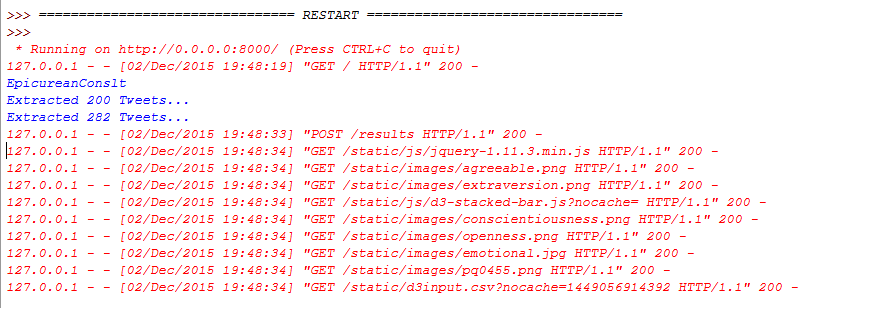
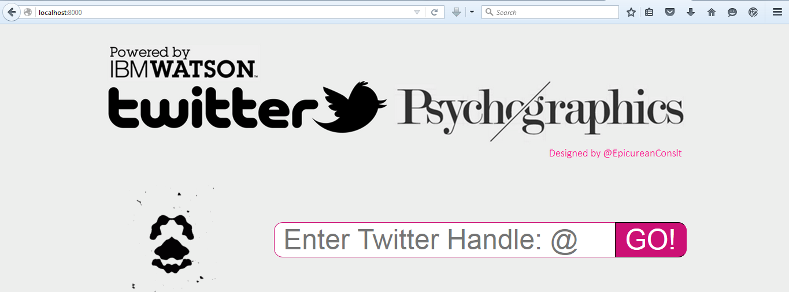
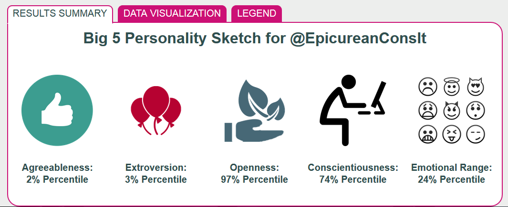
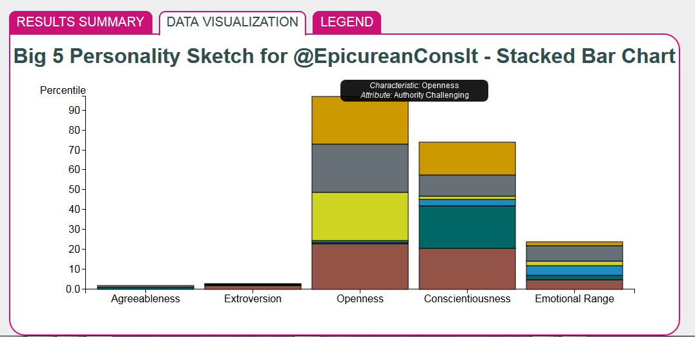

<h1> Twitter Psychographics On Watson </h1>

Generate a Big-5 Personality model for a Twitter user, by analyzing his or her recent tweets

Demo: http://twitter-psychographics.mybluemix.net/

<h1> Key Components </h1>

1. Twitter API
2. Watson API
3. Python Flask Framework
4. d3.js (for creating stacked bar chart)
5. HTML/CSS/JS
6. BlueMix Hosting Configurations

   

   

   

   
